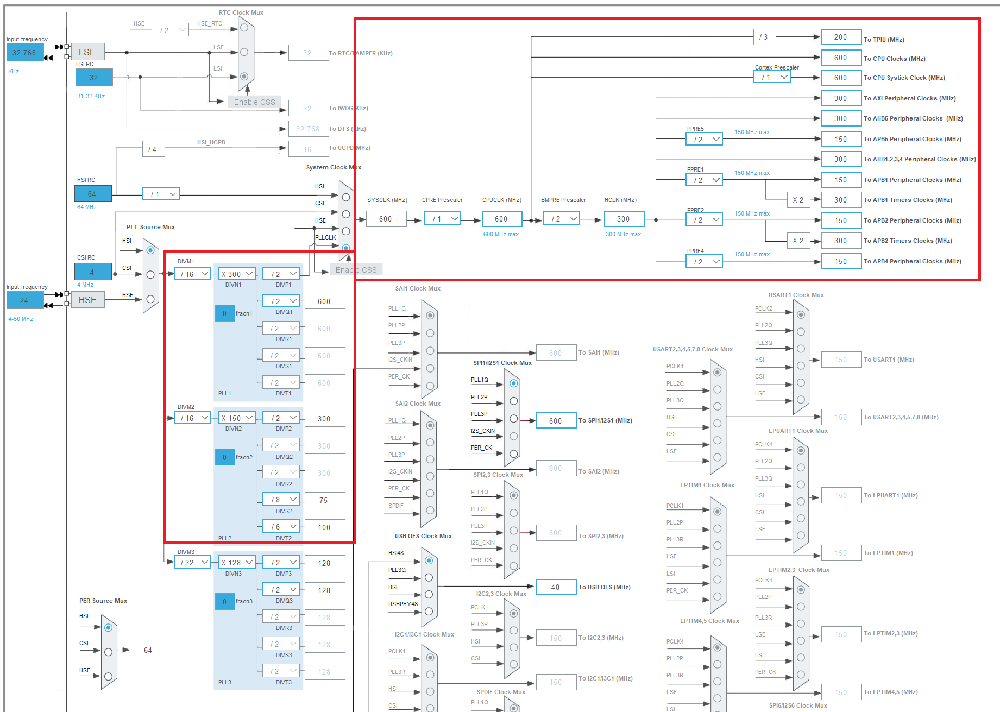
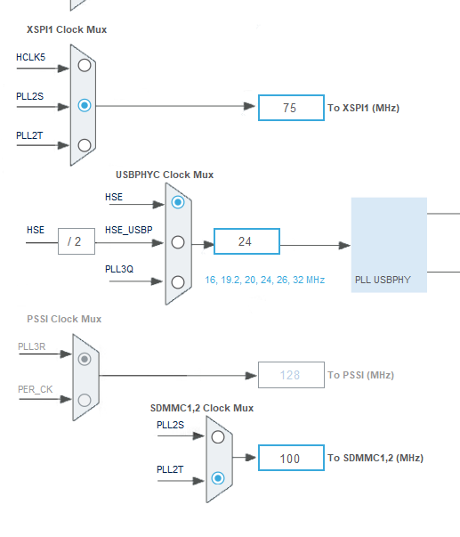

# Project setup for STM32H7R3zx

when you create a project for `STM32H7R3zx` chip,
you can see three sub-project options.

1. `Boot`: A project to program the internal 64k flash.
2. `Application`: A project's body.
3. `External Loader`: A loader to program the external flash.

if you don't need external flash, you can skip 2nd ~ 3rd projects.
Note that, if you don't enable `External Loader`, you can not program `XIP` flash.

## Memory layout.
```
ADDR            BOOT                APPLICATION
0000 0000       ITCM                ITCM
0800 0000       Flash (internal)    Reserved
...
1ff0 0000       System Memory (SRAM, 128K)
2000 0000       DTCM Memory (SRAM, 64K)
2400 0000       AXI SRAM1 ~ 3 (SRAM, 128K x 3 + 72K)
3000 0000       AHB SRAM1 ~ 2 (SRAM, 16K x 2)
3880 0000       Backup SRAM (SRAM, 4K)
...
6000 0000       FMC Bank1 (256M)
7000 0000       XSPI2 (256M)
8000 0000       FMC Bank3 (256M)
9000 0000       External Memory, XSPI1 (256M)       <-- for external flash.
...
```

## Minimal Configurations

Below are the minimum peripherals and settings you need to configure.
You can proceed in the order listed below.

1. System Core: `RCC`.
2. Trace and Debug: `DEBUG`.
3. Connectivity: `XSPI1`.
4. Timers: one of list, for example: `TIM1`.
5. Middleware and Software Packs: `EXTMEM_LOADER`, `EXTMEM_MANAGER`.
6. System Core: `SYS`, `_BOOT`, `_APPLI`.
7. Clock configuration.

### System Core: RCC.

1. Enable `High Speed Clock (HSE)`: `Crystal/Ceramic Resonator`.
2. Enable `Low Speed Clock (LSE)`: `Crystal/Ceramic Resonator`.

### Trace and Debug: DEBUG.

1. Enable `Runtime contexts`: `Boot`, `Application`.
2. Set `Debug` method: `Serial Wire` (ST-Link).

### Connectivity: XSPI1.

In here, `CS` pin should be set for your board design.
And parameter settings are too. below procedures are for using `W25Q64` NOR flash.

1. Enable `Runtime contexts`: `Boot`, `Application`, `ExtMemLoader`.
2. Set `Mode`: `Quad SPI`.
3. Set `Port`: `Port1 Quad`.
4. Set `Chip Select Override`: `NCS1 -- Port1 --`.
5. Let's see `Configuration` in below.
6. Set `Fifo Threshold` to `4`.
7. Set `Memory Type` to `Macronix`.
8. Set `Memory Size` to `64 MBits`.
9. Set `Chip Select High Time Cycle`: `2`.
10. Set `Free Running Clock` to `Disable`.
11. Set `Clock Mode` to `Low`.

And, you don't need to configure other pages in `XSPI1`.
because, `XSPI1` will be set as `XIP` mode, so no interrupt, no DMA needed.

### Timers: TIM1.

Enable `Runtime contexts`: `Boot`, `Application`.
No other configuration is needed. 
because `Timebase Source` timer's other functions would be disabled after set it.

### Middleware and Software Packs: EXTMEM_LOADER.

below procedures are for using `W25Q64` NOR flash.
You need to read flash memory's datasheet if it is not `W25Qxx` series.

1. Click `EXTMEM_LOADER` in list.
2. Enable `Activate External Memory Loader`.
3. Let's see `Configuration` in below.
4. Set `select the memory` to `Memory 1`.
5. Set `Loader name` to `MY_EXTMEM_LDR`.
6. Set `Number of sectors` to `2048`.
7. Set `Sector size` to `4096`.
8. Set `Page size` to `0x100`.
9. Set `Program Page Timeout` to `10000 ms`.
10. Set `Erase Sector Timeout` to `10000 ms` --> to prevent unexpected abnormal behavior.

### Middleware and Software Packs: EXTMEM_MANAGER.

1. Click `EXTMEM_MANAGER` in list.
2. Enable `Activate External Memory Manager`.
3. Let's see `Configuration` in below.
4. Set `Selection of the boot system` to `Execute In Place`.
5. Set `select the memory` to `Memory 1`.
6. Click `Memory 1` in tabs.
7. Set `Select the memory driver` to `EXTMEM_NOR_SFDP`.
8. Set `Memory Instance` to `XSPI1`.
9. Set `Number of memory data line` to `EXTMEM_LINK_CONFIG_1LINE`.

### System Core: SYS.

1. Enable `Runtime contexts`: `Boot`, `Application`.
2. Set the `Timebase Source` to `TIM1` (example).

### System Core: `_BOOT` and `_APPLI`.

Now, let's configure the MPU for both `_BOOT` and `_APPLI` contexts.
These configurations are same. 

because, `BOOT` context will jump to `APPLI` context after few validations,
it requires same `MPU` configurations to avoid `Memory management fault` exception.

1. Let's see `Cortex Memory Protection Unit Region 1 Settings`.
2. Set `MPU Region` to `Enabled`.
3. Set `MPU Region Base Address` to `0x90000000` (see memory layout).
4. Set `MPU Region Size` to `8MB` (this must be same with `XSPI1`).
5. Set `MPU TEX field level` to `level 1`.
6. Set `MPU Access Permission` to `ALL ACCESS PERMITTED` (you can alter this after test).
7. Set `MPU Instruction Access` to `ENABLE`.
8. Set `MPU Shareability Permission` to `ENABLE`.
9. Set `MPU Cacheable Permission` to `ENABLE` (this improve code execution performance).
9. Set `MPU Bufferable Permission` to `ENABLE`.

### Clock configuration.



1. Set `DIVM1` in `PLL` to `/16`.
2. Set `DIVN1` to `X 300`.
3. Set all `DIVx1` to `/2` --> then, `SYSCLK` will be `600 MHz`.
4. Set `DIVM2` to `/16` and `DIVN2` to `X 150`.
5. Set `DIVS2` to `/8` and, `XSPI1 Clock Mux` to `PLL2S`.
6. then, `XSPI1` clock speed will be `75 MHz`.
7. Set `DIVT2` to `/6` and its output becomes to `100 MHz`.
8. Now, we'll configure main clock tree for `APB`, `AHB`s.
9. Set `CPRE Prescaler` to `/1`, so you can see `600 MHz` in `CPUCLK`.
10. Set `BMPRE Prescaler` to `/2`, so `HCLK` becomes to `300 MHz`.
11. Set `PPRE1`, `PPRE2`, `PPRE4`, `PPRE5` to `/2`.
12. So, `xxx Peripheral Clocks` becomes to `150 MHz`.
13. And, Cube IDE will set `X 2` for `Timer Clocks`, so becomes to `300 MHz`.



Commonly, `W25Qxx` series can work well up to `100 MHz`.
So, Both `/6` (100 MHz) and `/7` (85.714 MHz) for `DIVS2` are compatible.
But, for testing, it must be `75 MHz` to avoid unexpected abnormal behaviors.

### Additional information for SDMMCs.
`DIVT2` is for `SDMMC`s. And `SDMMC` clock mux must be set to `PLL2T`.

in SDMMC configuration, its clock divider can be set to `4` or others for clock speed limit.
This value is important because most eMMC or SDcards (microSD) can malfunction if the initial communication speed is too fast.

and, the clock divider must be carefully set to avoid producing decimal points.

## Setup `BOOT` project for successful boot.

### Structure of compiled `Application`.

This can be trace-able from `ld` file.
```
(heading of program: .isr_vector, specified at LD file)

Offset      Description
+ 0x0000    Initial stack pointer.
+ 0x0004    Reset_Handler           << -- program entry.
...
```

### W25Qxx driver.
See `STM32/H7R3Zx` directory.
Copy `w25qxx_xspi.h` and `w25qxx_xspi.cpp` files to your source code directory of `BOOT` project.
(Or re-write your own driver)

### Edit `main.c` file.

Add an include after `#include "main.h"`.
```c
/* USER CODE END Header */
/* Includes ------------------------------------------------------------------*/
#include "main.h"

/* Private includes ----------------------------------------------------------*/
/* USER CODE BEGIN Includes */
#include "w25qxx_xspi.h"
/* USER CODE END Includes */
```

Check `XSPI` is mapped successfully.
```c
/* Private user code ---------------------------------------------------------*/
/* USER CODE BEGIN 0 */
static uint8_t checkXspiReady() {
	uint32_t vec = 0x90000000;      // --> address that `XSPI1` will be mapped: see `Initial stack pointer` and `Memory layout`.
	uint32_t data;

	data = *(uint32_t *)vec;

    // --> check stack pointer range: 0x24000000 ~, AXI SRAM1 ~ 3 (SRAM, 128K x 3 + 72K).
	if((data & 0x2FF80000 ) == 0x24000000)
		return 1;

    // --> check stack pointer range: 0x24000000 ~, DTCM Memory (SRAM, 64K).
	else if((data & 0x2FF80000 ) == 0x20000000)
		return 1;

    // --> check stack pointer range: 0x30000000 ~, AHB SRAM1 ~ 2 (SRAM, 16K x 2), or Backup SRAM (SRAM, 4K).
	else if((data & 0x3FF80000 ) == 0x30000000)
		return 1;

    // --> NULL or not programmed.
	else if((data & 0x3FF80000 ) == 0x00000000)
		return 1;

    return 0;
}

```

Jump to `XIP` code.
```c
static uint8_t jumpToXip(void) {
  uint32_t primask_bit;
  typedef  void (*pFunction)(void);
  static pFunction JumpToApp;
  uint32_t vec = 0x90000000;

  /* Suspend SysTick */
  HAL_SuspendTick();

#if defined(__ICACHE_PRESENT) && (__ICACHE_PRESENT == 1U)
  /* if I-Cache is enabled, disable I-Cache-----------------------------------*/
  if (SCB->CCR & SCB_CCR_IC_Msk) {
    SCB_DisableICache();
  }
#endif /* defined(__ICACHE_PRESENT) && (__ICACHE_PRESENT == 1U) */

#if defined(__DCACHE_PRESENT) && (__DCACHE_PRESENT == 1U)
  /* if D-Cache is enabled, disable D-Cache-----------------------------------*/
  if (SCB->CCR & SCB_CCR_DC_Msk) {
    SCB_DisableDCache();
  }
#endif /* defined(__DCACHE_PRESENT) && (__DCACHE_PRESENT == 1U) */

  /* Initialize user application's Stack Pointer & Jump to user application  */
  primask_bit = __get_PRIMASK();
  __disable_irq();

  SCB->VTOR = (uint32_t)vec;
  JumpToApp = (pFunction) (*(__IO uint32_t *)(vec + 4u));       // --> take function that points `Reset_Handler` in `XIP` range.

#if ((defined (__ARM_ARCH_8M_MAIN__ ) && (__ARM_ARCH_8M_MAIN__ == 1)) || \
     (defined (__ARM_ARCH_8_1M_MAIN__ ) && (__ARM_ARCH_8_1M_MAIN__ == 1)) || \
     (defined (__ARM_ARCH_8M_BASE__ ) && (__ARM_ARCH_8M_BASE__ == 1))    )
  /* on ARM v8m, set MSPLIM before setting MSP to avoid unwanted stack overflow faults */
  __set_MSPLIM(0x00000000);
#endif  /* __ARM_ARCH_8M_MAIN__ or __ARM_ARCH_8M_BASE__ */

  __set_MSP(*(__IO uint32_t*) vec); // --> set stack pointer.

  /* Re-enable the interrupts */
  __set_PRIMASK(primask_bit);

  JumpToApp();                      // --> jump to `Reset_Handler` in `XIP` range.
  return SUCCESS;
}
```

Finally, Add codes to `main` function.
```c
int main(void) {

  /* USER CODE BEGIN 1 */

  /* USER CODE END 1 */

  /* MPU Configuration--------------------------------------------------------*/
  MPU_Config();

  /* MCU Configuration--------------------------------------------------------*/

  /* Reset of all peripherals, Initializes the Flash interface and the Systick. */
  HAL_Init();

  /* USER CODE BEGIN Init */

  /* USER CODE END Init */

  /* Configure the system clock */
  SystemClock_Config();

  /* USER CODE BEGIN SysInit */

  /* USER CODE END SysInit */

  /* Initialize all configured peripherals */
  MX_GPIO_Init();
  MX_XSPI1_Init();
  /* USER CODE BEGIN 2 */
  XSPI_NOR_Init();                          // --> initialize XSPI and W25Qxx XIP driver, defined at `w25qxx_xspi.{h,cpp}`.
  XSPI_NOR_EnableSTRMemoryMappedMode();     // --> enable memory mapped mode and XIP mapping.

  if (checkXspiReady()) {
	  jumpToXip();
  }

  /* USER CODE END 2 */

  /* Infinite loop */
  /* USER CODE BEGIN WHILE */
  // --> if reached here, `checkXspiReady` is failed, or `jumpToXip` didn't perform jump.
  while (1)
  {
	HAL_GPIO_WritePin(GPIOB,GPIO_PIN_2,GPIO_PIN_SET);
	HAL_Delay(50);
	HAL_GPIO_WritePin(GPIOB,GPIO_PIN_2,GPIO_PIN_RESET);
	HAL_Delay(50);
	HAL_GPIO_WritePin(GPIOB,GPIO_PIN_2,GPIO_PIN_SET);
	HAL_Delay(50);
	HAL_GPIO_WritePin(GPIOB,GPIO_PIN_2,GPIO_PIN_RESET);
	HAL_Delay(500);
    /* USER CODE END WHILE */

    /* USER CODE BEGIN 3 */
  }
  /* USER CODE END 3 */
}
```

## Configure `Debug` in STM32CubeIDE.

you must run debug nin `XXXX_Appli` project in STM32CubeIDE.

open `Debug Configuration` window by:
1) right click on project, `XXXX_Appli`.
2) click `Debug As` and `Debug configurations`.
3) click `Debugger` tab.
4) scroll down and see `External loaders`.
5) add `ExtMemLoader` project to `External loaders` --> this is automatically done by STM32CubeIDE.
6) if `Initialize` is `false` for 6th loader, click it and `Edit` button, then, enable `Initialize`.
7) click `Startup` tab.
8) add `Boot` project to `Load Image and Symbols` list.
9) now, you can debug the application by clicking `Debug` or `Run` icons in tool bar.